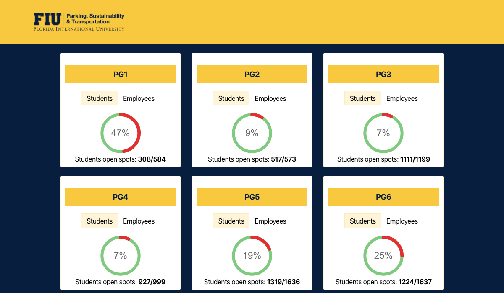

<!-- PLEASE DO NOT EDIT THIS FILE! -->

# public-demos   

> A collection of my public demos.

[react-pll.demos.abranhe.com](https://react-pll.demos.abranhe.com)

[christmas-message.demos.abranhe.com](https://christmas-message.demos.abranhe.com)

[step-form.demos.abranhe.com](https://step-form.demos.abranhe.com)

[health-insurance.demos.abranhe.com](https://health-insurance.demos.abranhe.com)

[healthplanrate.demos.abranhe.com](https://healthplanrate.demos.abranhe.com)

[reactjs-context.demos.abranhe.com](https://reactjs-context.demos.abranhe.com)

[burialinsurance.demos.abranhe.com](https://burialinsurance.demos.abranhe.com)

[fiu-parking.demos.abranhe.com](https://fiu-parking.demos.abranhe.com)

## License

MIT © [Carlos Abraham](https://github.com/abranhe)